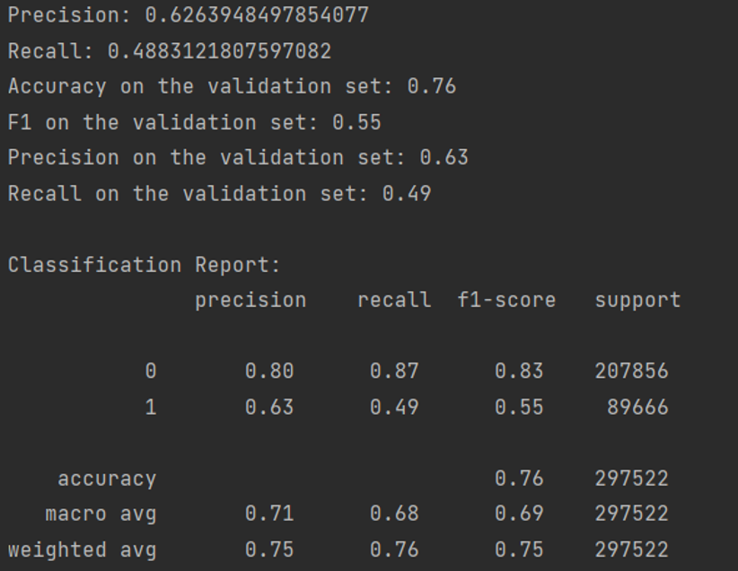
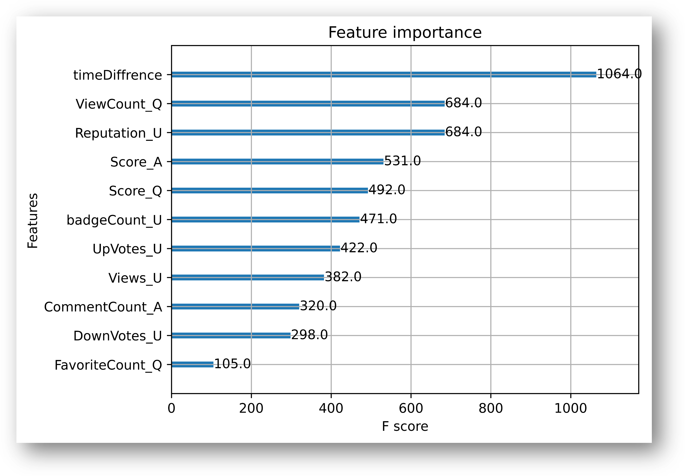
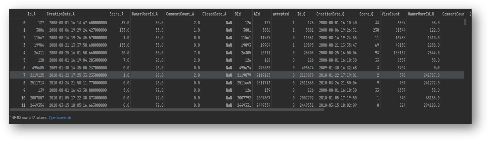
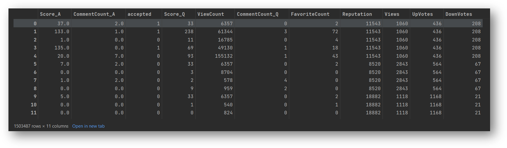
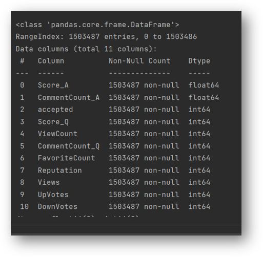
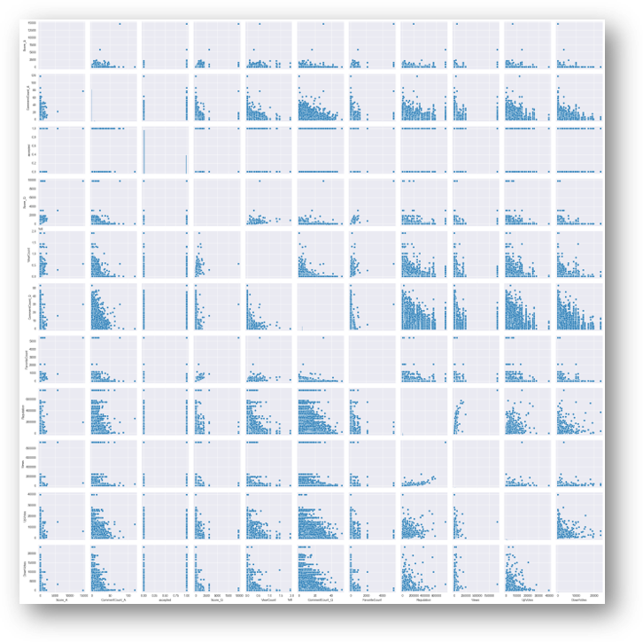
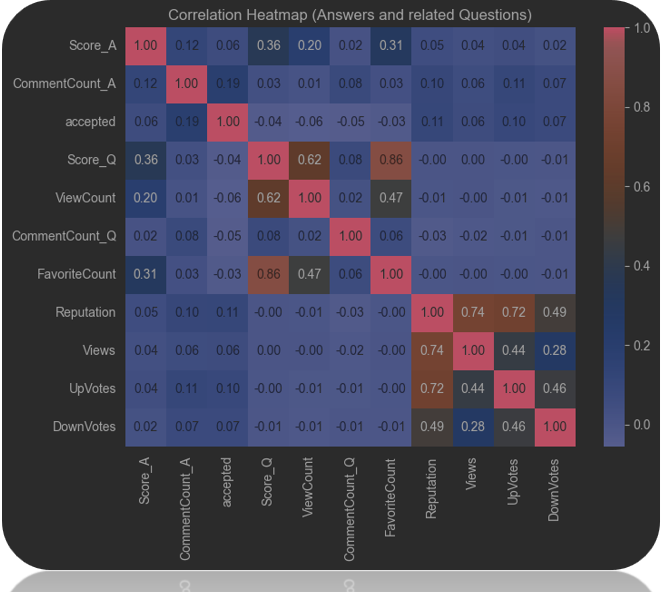
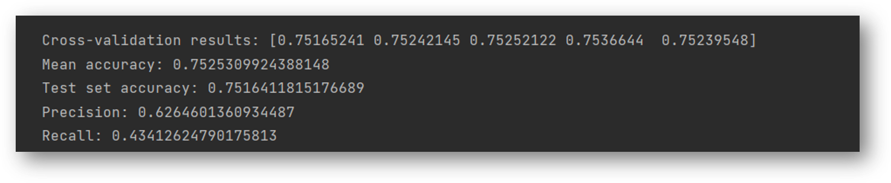
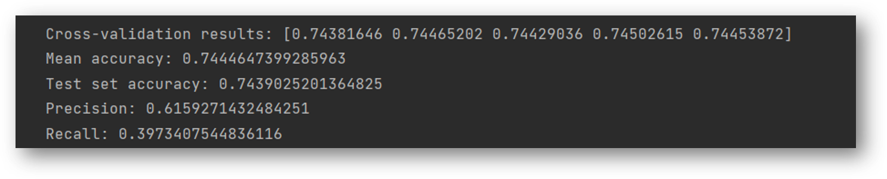
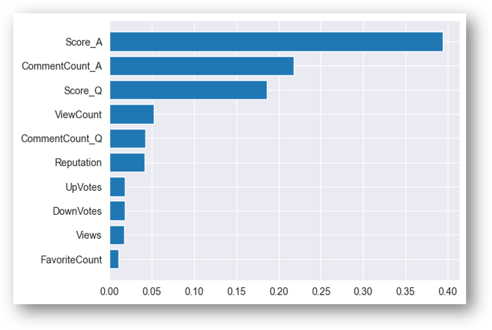

# SOF output file analysis part C

We aim to address the following questions next:<br>
Implement a classifier using XGBoost to detect Accepted answers.<br>
Report the precision and recall of the classifier using a metric P and R.<br>
Utilize cross-validation method.<br>
Report which features have been the most important.<br>


# Description

In this section, we merge the dataset files, join the necessary columns together, and adjust the times based on hour and minute.

```python
merged_A_Q = pd.merge(answers, Q_A, left_on='Id', right_on='AId', how='inner')
merged_A_Q = pd.merge(merged_A_Q, questions, left_on='QId', right_on='Id', how='inner',suffixes=('_A', '_Q'))
merged_A_Q_U2 = pd.merge(merged_A_Q, users,  left_on='OwnerUserId_A', right_on='Id', how='left')
badge_count = user_badge.groupby('UserId').size().reset_index(name='badgeCount')
merged_A_Q_U_B = pd.merge(merged_A_Q_U2, badge_count, left_on='Id', right_on='UserId', how='inner')
merged_A_Q_U_B['Closed_Q'] = merged_A_Q_U_B['ClosedDate_Q'].notnull().astype(int)
merged_A_Q_U_B['CreationDate_A'] = pd.to_datetime(merged_A_Q_U_B['CreationDate_A'])
merged_A_Q_U_B['CreationDate_Q'] = pd.to_datetime(merged_A_Q_U_B['CreationDate_Q'])
merged_A_Q_U_B['timeDiffrence'] = (merged_A_Q_U_B['CreationDate_A'] - merged_A_Q_U_B['CreationDate_Q']).dt.total_seconds() / 60 / 60 #based on hours
merged_A_Q_U_B2 = merged_A_Q_U_B[merged_A_Q_U_B['timeDiffrence']>0]
```

Selecting necessary features for model training:
Datasets: `answer`, `question`, `Q_A`, `users`, `user_badge`.<br>

```python
features = ['Score_A', 'CommentCount_A',
         'Reputation_U', 'Views_U', 'UpVotes_U',
       'DownVotes_U', 'badgeCount_U', 'timeDiffrence','FavoriteCount_Q', 'Score_Q','ViewCount_Q']
target = 'accepted'
```

Selecting test and train datasets:

```python
X = merged_A_Q_U_B2[features]
y = merged_A_Q_U_B2[target]
X_train, X_test, y_train, y_test = train_test_split(X, y, test_size=0.2, random_state=42)
```
Model Performance Report:



Feature Importance Order in Model Training:



## The following is about the execution of the XGboost code:

Most Important Features:

```python
answers_q_a = pd.merge(answers, q_a, left_on='Id', right_on='AId', how='inner')
answers_question = pd.merge(answers_q_a, questions, left_on='QId', right_on='Id', how='inner', suffixes=('_A', '_Q'))
```

```python
answers_question_user = pd.merge(answers_question, users, left_on='OwnerUserId_A', right_on='Id', how='inner',suffixes=('', '_U'))
```

```python
answers_question_user
```



```python
data = answers_question_user.drop(['Id_A', 'OwnerUserId_A','Id_Q', 'AId', 'QId','OwnerUserId_Q', 'Id' ,'CreationDate_A', 'CreationDate_Q', 'ClosedDate_A','ClosedDate_Q'], axis=1)
data
```


```python
data.info()
```

```python
sns.pairplot(data)
plt.show()
```


Correlation between all features:

```python
correlation_matrix = data.corr()
# Plot heatmap
plt.figure(figsize=(8, 6))
sns.heatmap(correlation_matrix, annot=True, cmap='coolwarm', fmt='.2f')
plt.title('Correlation Heatmap (Answers and related Questions)')
plt.show()
```


Training model based on all features:

```python
from sklearn.model_selection import train_test_split, cross_val_score
from xgboost import XGBClassifier
from sklearn.metrics import accuracy_score, precision_score, recall_score


X = data.drop('accepted', axis=1)
y = data['accepted']

X_train, X_test, y_train, y_test = train_test_split(X, y, test_size=0.2, random_state=42)
xgb_model = XGBClassifier()
cv_results = cross_val_score(xgb_model, X_train, y_train, cv=5, scoring='accuracy')

print("Cross-validation results:", cv_results)
print("Mean accuracy:", cv_results.mean())

xgb_model.fit(X_train, y_train)

y_pred = xgb_model.predict(X_test)

accuracy = accuracy_score(y_test, y_pred)
precision = precision_score(y_test, y_pred)
recall = recall_score(y_test, y_pred)

print("Test set accuracy:", accuracy)
print("Precision:", precision)
print("Recall:", recall)
```


Removing columns with low correlation:

```python
from sklearn.model_selection import train_test_split, cross_val_score
from xgboost import XGBClassifier
from sklearn.metrics import accuracy_score, precision_score, recall_score

X = data_enhanced.drop('accepted', axis=1)
y = data_enhanced['accepted']

X_train, X_test, y_train, y_test = train_test_split(X, y, test_size=0.2, random_state=42)

xgb_model = XGBClassifier()

cv_results = cross_val_score(xgb_model, X_train, y_train, cv=5, scoring='accuracy')

print("Cross-validation results:", cv_results)
print("Mean accuracy:", cv_results.mean())

xgb_model.fit(X_train, y_train)

y_pred = xgb_model.predict(X_test)

accuracy = accuracy_score(y_test, y_pred)
precision = precision_score(y_test, y_pred)
recall = recall_score(y_test, y_pred)

print("Test set accuracy:", accuracy)
print("Precision:", precision)
print("Recall:", recall)
```


Order of importance of features in model training:

```python
sorted_idx = xgb_model.feature_importances_.argsort()
plt.barh(X.columns[sorted_idx], xgb_model.feature_importances_[sorted_idx])
```


## Find best params

```python
import pandas as pd
from sklearn.model_selection import train_test_split, GridSearchCV
from xgboost import XGBClassifier
from sklearn.metrics import accuracy_score, precision_score, recall_score

X = data.drop('accepted', axis=1)
y = data['accepted']

X_train, X_test, y_train, y_test = train_test_split(X, y, test_size=0.2, random_state=42)

xgb_model = XGBClassifier()

param_grid = {
    'max_depth': [3, 5, 7],
    'learning_rate': [0.01, 0.1, 0.2],
    'n_estimators': [50, 100, 200],
    'subsample': [0.8, 1.0],
    'colsample_bytree': [0.8, 1.0]
}

grid_search = GridSearchCV(estimator=xgb_model, param_grid=param_grid, scoring='accuracy', cv=5, n_jobs=-1)

grid_search.fit(X_train, y_train)

print("Best Parameters:", grid_search.best_params_)
print("Best Accuracy:", grid_search.best_score_)

best_xgb_model = grid_search.best_estimator_
best_xgb_model.fit(X_train, y_train)

y_pred = best_xgb_model.predict(X_test)

accuracy = accuracy_score(y_test, y_pred)
precision = precision_score(y_test, y_pred)
recall = recall_score(y_test, y_pred)

print("Test set accuracy:", accuracy)
print("Precision:", precision)
print("Recall:", recall)
```
